# X's and O's - A game of Tic Tac Toe

### **[Click here to visit the live website](https://mark-o-s.github.io/Xs-and-Os/)**

This is my JavaScript project of Tic Tac Toe. A fun game where 2 players can take turns in playing against each other.

<!-- Table of Contents start -->

# *Table of Contents*
- [UX & Design](#ux--design)
    - [User Goals](#user-goals)
    - [User Stories](#user-stories)
    - [Wireframes](#wireframes)
    - [Colour Scheme](#colour-scheme)
- [Features](#features)
- [Technologies Used](#technologies-used)   
- [Testing](#testing)

<!-- Table of Contents finish -->

# UX & Design
The website has two pages. The first page, to give the user the option to have a look at how to play the game along and the second page to play the game.

### User Goals
- To be able to play the game and find out who wins.
- To find and read how to play the game if needed.
- To find out more information on who created the website.

### User Stories
- As a user, I would like to be able to navigate the site easily.
- As a user, I would like to be able to find out how to play the game if I don't know how to play.
- As a user, I would like to have the option to play again if I have already completed a game.
- As a user, I would like to be able to find out more about who created the website and to find external links to see the creators other pieces of work or information.

## Wireframes

I used [Balsamiq](https://balsamiq.com/wireframes/) in order to create the wirframes of the website. This was used as my guide towards building the finish project. Scroll down below to see the wireframes for both mobile and desktop versions.

### Main Page

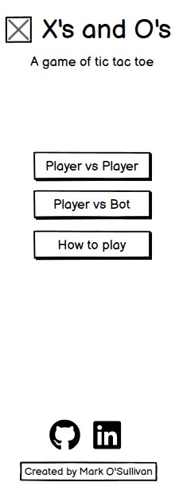
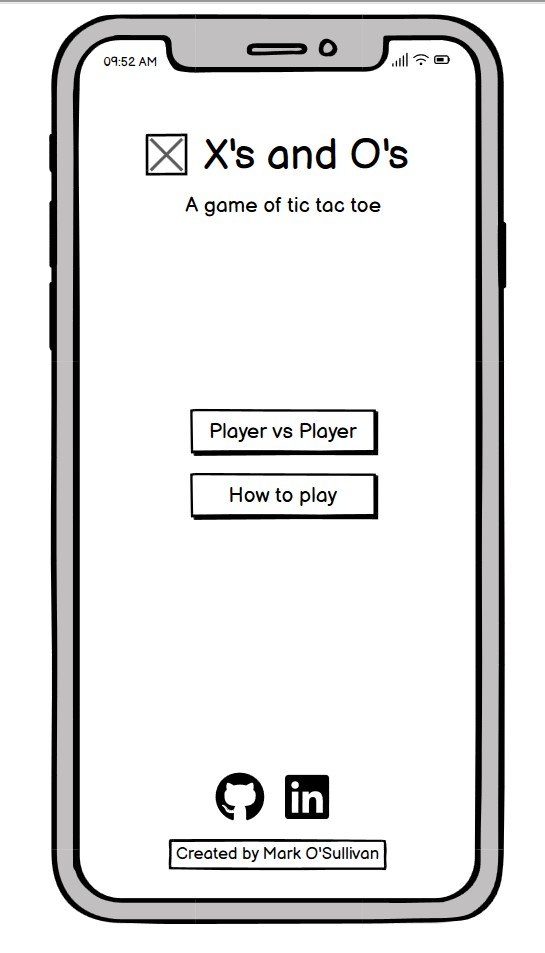

### How to Play Section

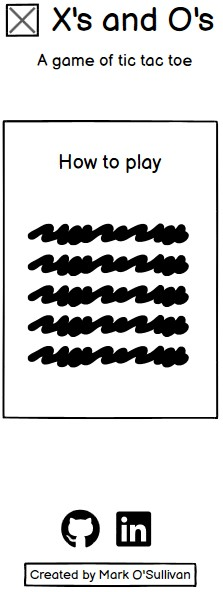
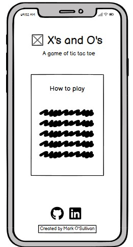

### Game Section

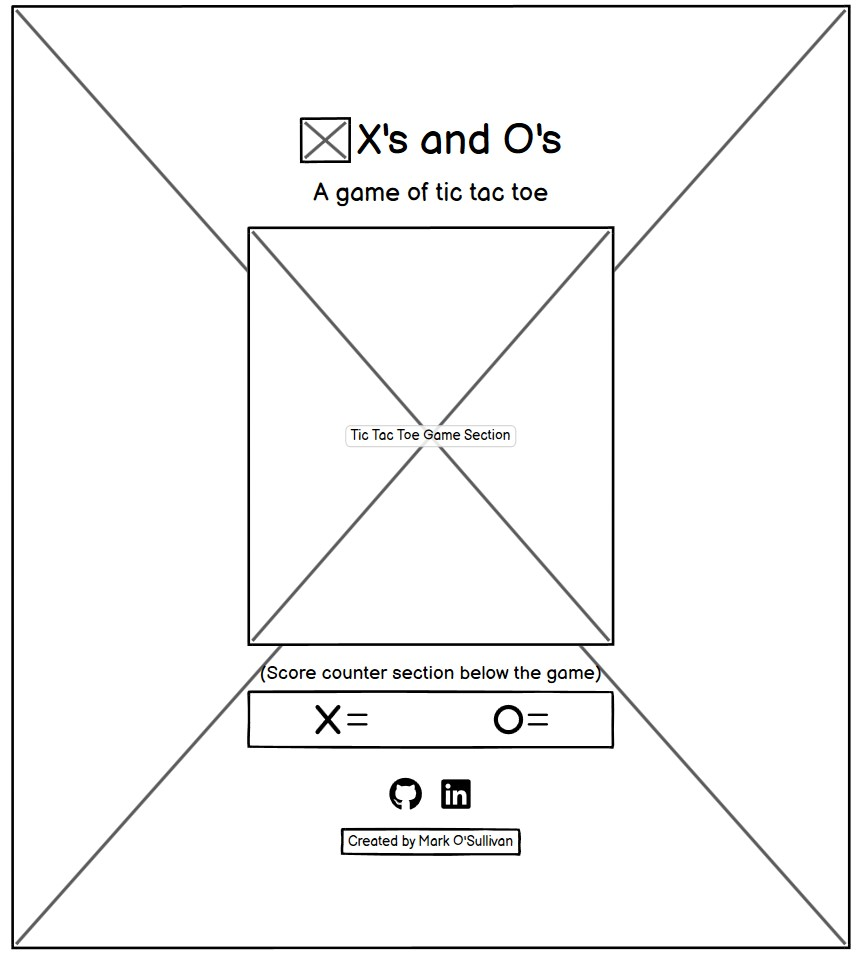
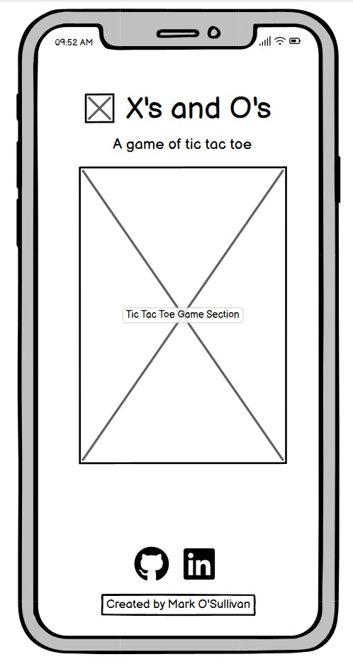

### Game Result Section

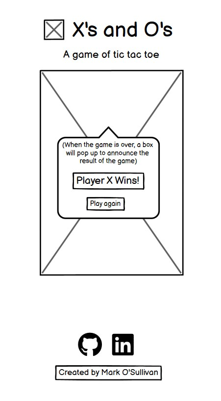
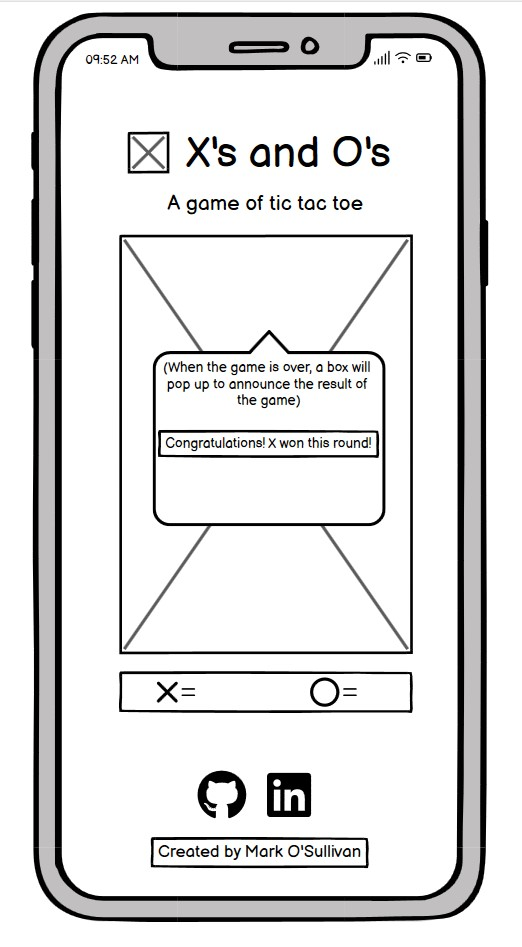

### Colour Scheme
I used [Coolors.co](https://coolors.co/000000-ffffff-4fc3f7-e53935-f44336-43a047-4caf50) for choosing the colour scheme of the website.

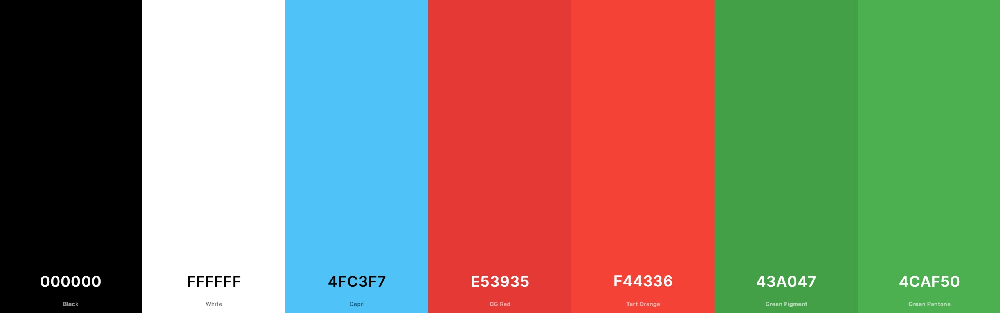

[Back to Table of Contents](https://github.com/Mark-O-S/Xs-and-Os#table-of-contents)

# Features

 ### Responsive Logo

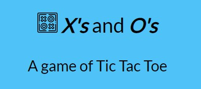
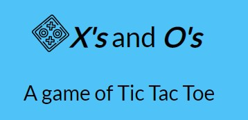

The top section of the website contains a responsive logo that will do two things if you hover and click it:
1. If you hover above the logo icon, you will see the logo rotate. This gives a subtle hint of extra responsiveness while navigating the website.
2. Both the logo icon and the title allows the user to click it, taking the user back to the main landing page.

### Responsive options

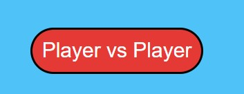
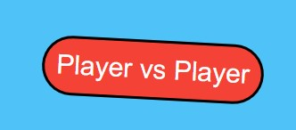

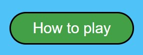

- In the body of the main page, hovering above the buttons "Player vs Player" and "How to play" will cause the button to rotate slightly and change to a lighter color. I believe that this gives more responsiveness to the website.

### Responsive footer icons

- In the footer section of the website, I have made the icons responsive for when a user hover aboves the icon. Clicking either of the icons takes the user to the creators webpage of the website that the user clicks into.

### How to play section

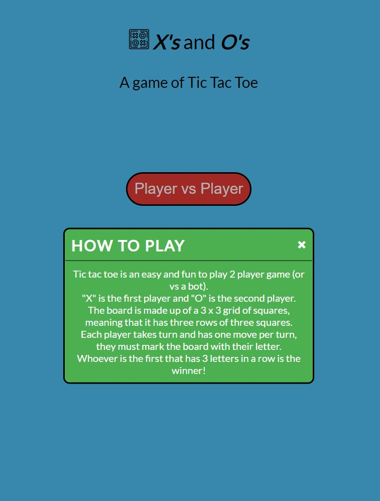

- If the user click "How to play" a responsive pop up modal box will appear to give the user instructions on how to play the game. To exit the box, the user can simply click anywhere outside of the box or click the "X" button on the top-right side of the pop up box.

### The game
Below will display the responsiveness of the game:
- Before placing either "X" or "O" inside of the cells, the user will be able to see where they will be placing their marker as it will show up in a lighter color.
- Once they place their marker the mark will become a darker color and the user will not be able to place any thing inside of that cell for the remainder of the game.

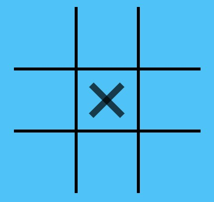
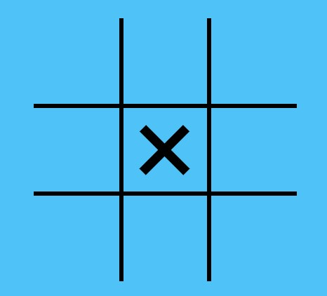

- When the game if over, a pop up box will appear to notify the users who has won the game.
- It will also give the users the option to play again.

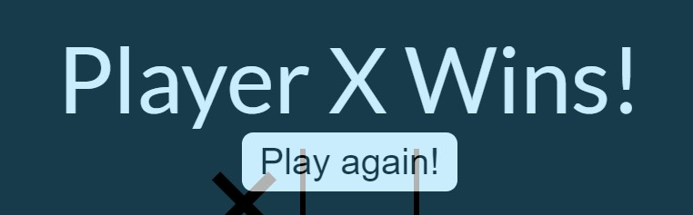
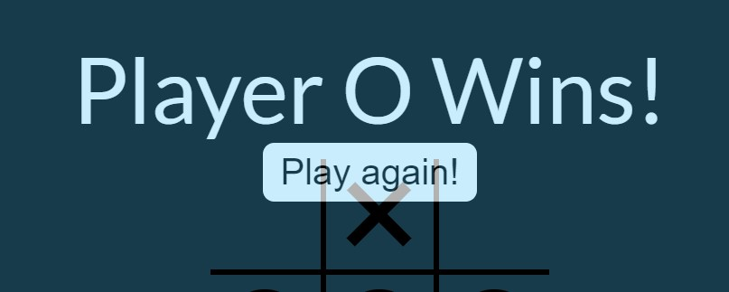
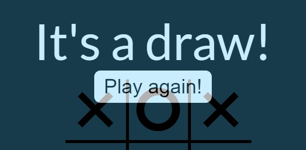

## Features to add in the future
- I would like to add the option for a user to play against a bot if they wanted to. This can be done with the help of math.random() method.
- I would like to add a sound effect for each time a user places their mark on the cell and different sound effects for when the game is won, lost or if it's a draw.
- I would like to add a score card underneath the game in the event that games are played multiple times and if the user(s) wanted to keep track of their scores.

[Back to Table of Contents](https://github.com/Mark-O-S/Xs-and-Os#table-of-contents)

# Technologies Used
The following list are the types of technologies used in the creation of this website:
- **[HTML5](https://en.wikipedia.org/wiki/HTML5)** (HyperText Markup Language) was used in creating the core content of the website.
- **[CSS3](https://en.wikipedia.org/wiki/CSS)** (Cascading Style Sheet) was used in styling the website.
- **[JavaScript](https://en.wikipedia.org/wiki/JavaScript)** was used to add functionality to the game and pop up boxes.
- **[Balsamiq](https://balsamiq.com/wireframes/)** was used in designing the wireframes of the website prior to the creation of each page.
- **[Google Fonts](https://fonts.google.com/)** was used to link and source different types of fonts for the website.
- **[Font Awesome](https://fontawesome.com/)** was used to link and source different icons for the footer section.
- **[Pexels](https://www.pexels.com/)** was used to source free copyright images which were used for the website.
- **[TinyPNG](https://tinypng.com/)** was used to compress any image that was used for the website.
- **[Coolors.co](https://coolors.co/000000-ffffff-4fc3f7-e53935-f44336-43a047-4caf50)** was used for choosing the colors for the website.

[Back to Table of Contents](https://github.com/Mark-O-S/Xs-and-Os#table-of-contents)

# Testing

## Cross-browser Testing
The website was tested across 3 web browsers:
- Google Chrome - no issues detected
- Microsoft Edge - no issues detected
- Mozzilla Firefox - no issues detected

## Compatibility Testing 
The website and game was tested across the following devices:
- 15" Screen, Dell Laptop - no issues detected
- Samsung Galaxy S10+ Mobile phone - no issues detected
- Computer with 27" screen - no issues detected

## Responsive Testing
- One issue arose during the creation stage was that I was not able to see the game fully playing out as I expected it to. 
- I changed keywords and functions around on the "script.js" file.
- I managed to fix this issue by moving the code "// Modal pop up box for the 'How to play' section". 
- After moving this and creating a separate file for the javascript functions, I was able to see my fully functioning code for both the modal pop up box and the game finally worked.
- I am still not sure as to why I have to separate these files and codes however.

Other than the modal pop up box issue, I encountered no further responsive test issue.

## Validator Testing
The **HTML** of the website was tested using the **[HTML Validator](https://validator.w3.org/)**.
- I encountered *one* error which pointed out that I had nested an anchor tag element inside of a button element. 

- To resolve this issue, i removed the anchor tag and added an onclick attribute so that the button remains functioning as intended.

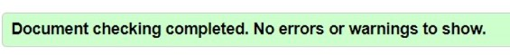

The **CSS** of the website was tested using the **[CSS Validator](https://jigsaw.w3.org/css-validator/)**

- No issues found when tested

    

## Known Bugs
To my knowledge, there are currently no bugs present in the website.

[Back to Table of Contents](https://github.com/Mark-O-S/Xs-and-Os#table-of-contents)

[Back to Table of Contents](https://github.com/Mark-O-S/Xs-and-Os#table-of-contents)
